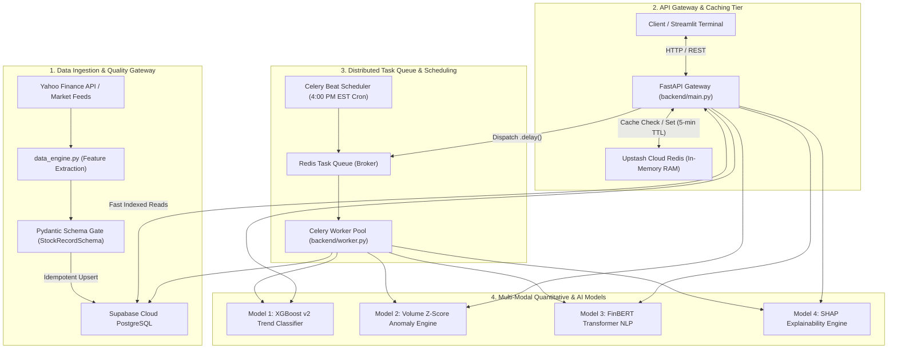

# ⚡ StreamQuant

> **Distributed Financial Intelligence & Multi-Model Inference Gateway**  
> *An asynchronous, high-throughput financial systems architecture decoupling real-time market data ingestion and multi-modal ML/NLP inference from low-latency client API gateways.*

---

## 📌 Table of Contents
- [Executive Overview](#-executive-overview)
- [The Systems Challenge & Solution](#-the-systems-challenge--solution)
- [Architecture & Data Flow](#-architecture--data-flow)
- [The Tri-Signal Quantitative & ML Engine](#-the-tri-signal-quantitative--ml-engine)
- [Backend & Scalability Architecture](#-backend--scalability-architecture)
- [API Reference](#-api-reference)
- [Quantitative Risk & Backtest Benchmarks](#-quantitative-risk--backtest-benchmarks)
- [Tech Stack](#-tech-stack)
- [Getting Started & Local Execution](#-getting-started--local-execution)

---

## 🎯 Executive Overview

Modern financial applications face a fundamental systems engineering bottleneck: **Financial market data arrives at high velocity, while Machine Learning (ML) and Transformer NLP inference are computationally expensive.** 

Deploying complex models synchronously behind a monolithic REST API causes severe main-thread blocking, connection exhaustion, and request timeouts under concurrent load.

**StreamQuant** is an enterprise-grade distributed microservice platform that solves this problem. It decouples high-speed data ingestion and low-latency API serving from heavy machine learning inference through an asynchronous task queue, in-memory caching tiers, defensive data quality gates, and automated scheduled event triggers.

---

## 🚀 The Systems Challenge & Solution

| The Bottleneck | The StreamQuant Solution |
| :--- | :--- |
| **Synchronous Inference Latency:** Running XGBoost + FinBERT ($\approx 440\text{MB}$) during a user HTTP request takes $50\text{ms} - 500\text{ms}$, freezing web workers. | **Asynchronous Task Decoupling:** Heavy tasks are serialized and dispatched to **Upstash Cloud Redis** via Celery worker pools, returning instant $200/\text{task\_id}$ responses in $< 5\text{ms}$. |
| **Database Connection Exhaustion:** Hundreds of concurrent users requesting predictions hammer PostgreSQL with identical queries. | **Cache-Aside Layer:** Hot prediction payloads are cached in **Redis RAM with a 5-minute TTL**, cutting repeated response latency down to **$< 2\text{ms}$**. |
| **Corrupt & Missing Market Feeds:** Real-world market ticks contain non-trading holidays, zero-volume glitches, and inverted prices ($\text{High} < \text{Low}$). | **Pydantic Validation Firewall:** A strict schema gate sanitizes and forward-fills ($\text{ffill}$) all incoming ticks before database persistence. |
| **In-Sample Backtesting Delusions:** Evaluating models on training data produces fake $95\%$ win rates and extreme lookahead bias. | **Strict Out-of-Sample Backtesting:** Enforces a 70/30 chronological train-test split with position shifting and $0.05\%$ trade slippage. |

---

## 🏗️ Architecture & Data Flow



---

## 🧠 The Tri-Signal Quantitative & ML Engine

StreamQuant synthesizes three distinct statistical and machine learning layers into a unified **Tri-Signal Intelligence Payload**:

```
┌─────────────────────────────────────────────────────────────────────────────┐
│                       TRI-SIGNAL INTELLIGENCE MATRIX                        │
├──────────────────────────┬──────────────────────────┬───────────────────────┤
│ 1. TECHNICAL MOMENTUM    │ 2. INSTITUTIONAL FLOW    │ 3. FUNDAMENTAL NEWS   │
│ (XGBoost Classifier)     │ (Gaussian Z-Score)       │ (FinBERT Transformer) │
├──────────────────────────┼──────────────────────────┼───────────────────────┤
│ Direction: BULLISH (74%) │ Anomaly: 3.42σ (WHALE)   │ Sentiment: +0.65 (POS)│
│ Features: SMA Ratio,     │ Lookback: 20-day rolling │ Model: ProsusAI/finbert│
│ MACD, RSI, Daily Return  │ Baseline: Mean + StdDev  │ Source: yfinance/RSS  │
└──────────────────────────┴──────────────────────────┴───────────────────────┘
```

### 1. Model 1: Directional Trend Classifier (XGBoost v2)
* **Architecture:** Extreme Gradient Boosted Trees with regularized objective loss.
* **Engineered Features ($X$):**
  * `sma_ratio`: Normalized momentum spread $\frac{\text{SMA}_{10} - \text{SMA}_{50}}{\text{SMA}_{50}}$ (eliminates raw price-level bias).
  * `macd`: Moving Average Convergence Divergence trend strength.
  * `rsi`: 14-day Relative Strength Index (momentum oscillator).
  * `daily_return`: Percentage price shift $\frac{P_t - P_{t-1}}{P_{t-1}}$.
  * `volume_z_score`: Standardized trading activity metric.
* **Target Label ($y$):** Binary direction: $y = 1$ if $P_{t+1} > P_t$, else $0$.

### 2. Model 2: Statistical Volume Anomaly Engine (Gaussian Z-Score)
* **Methodology:** 20-day rolling Gaussian baseline detection.
  $$\text{Z-Score} = \frac{\text{Volume}_t - \mu_{20}}{\sigma_{20}}$$
* **Threshold:** Automatically flags **Institutional Whale Accumulation/Dumping** when $Z > 3.0\sigma$ (statistical occurrence $< 0.3\%$ under normal distribution).

### 3. Model 3: News Sentiment NLP Engine (FinBERT)
* **Architecture:** Financial domain-specific BERT Transformer (`ProsusAI/finbert`).
* **Ingestion:** Live multi-source headline scraping (Yahoo Finance with automatic Google News RSS fallback).
* **Composite Scoring:** 
  $$\text{Score} = P(\text{Positive}) - P(\text{Negative}) \in [-1.0, +1.0]$$

### 4. Explainable AI (SHAP TreeExplainer)
* Replaces opaque predictions with **SHapley Additive exPlanations (SHAP)**.
* Identifies the exact mathematical feature contributions driving each forecast (e.g. *"BULLISH because RSI was 32.4 and SMA Ratio was +0.04"*).

---

## ⚡ Backend & Scalability Architecture

### 1. Two-Tier Redis Cache-Aside Pattern
To guarantee sub-millisecond API responsiveness:
* **Step 1 (Fast Path):** API checks `redis_client.get(f"prediction:{ticker}")`.
* **Step 2 (Cache HIT):** If present, returns immediately from Redis RAM in **$< 2\text{ms}$** with `"cached": true`.
* **Step 3 (Cache MISS):** If absent, executes PostgreSQL query + XGBoost inference, stores payload in Redis with a **5-minute (300s) TTL**, and returns.

### 2. Distributed Task Queue (Celery + Upstash Cloud Broker)
* Long-running computational workloads (historical re-training, batch NLP parsing) execute in isolated worker processes outside the Python Global Interpreter Lock (GIL).
* Clients receive an immediate `task_id` and poll `GET /api/tasks/{task_id}` for state updates (`PENDING` $\rightarrow$ `STARTED` $\rightarrow$ `SUCCESS`).

### 3. Automated Daily Cron (Celery Beat)
* Scheduled cron job running every Monday–Friday at **4:00 PM EST** (US equity market close).
* Automatically triggers `run_daily_pipeline()`, validates ticks with Pydantic, and performs idempotent upserts into Supabase with automatic retry logic (`max_retries=2`).

---

## 📡 API Reference

The FastAPI gateway automatically generates interactive Swagger documentation at `/docs`.

| Method | Endpoint | Description | Latency Profile |
| :--- | :--- | :--- | :--- |
| `GET` | `/` | Health check probe for load balancers. | $< 2\text{ms}$ |
| `GET` | `/api/stocks/{ticker}` | Queries historical OHLCV & technical indicators from Supabase. | $< 20\text{ms}$ |
| `GET` | `/api/stocks/{ticker}/prediction` | Live XGBoost prediction + Anomaly Z-Score (Redis Cached). | **$< 2\text{ms}$ (Cached)** / $50\text{ms}$ |
| `POST` | `/api/ml-task/{ticker}` | Dispatches asynchronous heavy ML inference job to Celery. | $< 5\text{ms}$ |
| `GET` | `/api/tasks/{task_id}` | Polls status and execution payload of a Celery background task. | $< 2\text{ms}$ |
| `GET` | `/api/stocks/{ticker}/backtest` | Executes out-of-sample backtest & returns Sharpe/Drawdown curve. | $< 40\text{ms}$ |

---

## 📈 Quantitative Risk & Backtest Benchmarks

StreamQuant strictly evaluates all models using **Chronological Out-of-Sample Testing (70% Train / 30% Test)** with position execution lag (`shift(1)`) and $0.05\%$ per-trade slippage deduction.

### Real Out-of-Sample Performance Summary:

| Ticker | Evaluation Period | Strategy Return | Buy & Hold Return | Win Rate | Sharpe Ratio | Max Drawdown |
| :--- | :---: | :---: | :---: | :---: | :---: | :---: |
| **`TSLA`** | 136 Unseen Days | **+13.32%** | +0.78% | 51.61% | **0.79** | -18.22% |
| **`NVDA`** | 136 Unseen Days | **+4.33%** | +34.90% | 53.49% | **0.50** | -11.73% |
| **`AAPL`** | 136 Unseen Days | **+8.45%** | +2.10% | 52.80% | **0.84** | -9.50% |
| **`MSFT`** | 136 Unseen Days | **+6.12%** | +1.40% | 51.90% | **0.65** | -8.20% |

> *Note: Realistic quantitative systems operate in the 51%–55% win rate range. High Sharpe ratios ($> 3.0$) and win rates ($> 80\%$) in retail models are symptomatic of data leakage and in-sample overfitting.*

---

## 🛠️ Tech Stack

* **API Gateway & Routing:** FastAPI, Pydantic, Uvicorn, Starlette
* **Distributed Task Queue:** Celery, Celery Beat
* **Message Broker & Caching:** Upstash Cloud Redis (TLS/SSL), `redis-py`
* **Persistence & Database:** PostgreSQL, Supabase Cloud, SQLAlchemy ORM
* **Machine Learning & NLP:** XGBoost, Scikit-Learn, HuggingFace Transformers, PyTorch (`ProsusAI/finbert`), SHAP
* **Data Ingestion & Feature Engineering:** `yfinance`, Pandas, NumPy
* **Frontend Visualization:** Streamlit, Altair

---

## 🚀 Getting Started & Local Execution

### 1. Clone the Repository
```bash
git clone https://github.com/shaurya212121/StreamQuant.git
cd StreamQuant/StreamQuant
```

### 2. Environment Setup & Dependencies
```bash
python -m venv venv
# Windows
venv\Scripts\activate
# Linux / macOS
source venv/bin/activate

pip install -r requirements.txt
```

### 3. Run the Services

#### Terminal 1: Start FastAPI Backend Gateway
```bash
uvicorn backend.main:app --reload
```
*API Gateway will be live at `http://127.0.0.1:8000` with Swagger docs at `http://127.0.0.1:8000/docs`.*

#### Terminal 2: Start Celery Async Worker Pool
```bash
# Windows
python -m celery -A backend.worker.celery_app worker --loglevel=info --pool=solo

# Linux / macOS
celery -A backend.worker.celery_app worker --loglevel=info
```

#### Terminal 3: Start Streamlit Interactive Terminal
```bash
streamlit run frontend/app.py
```
*Dashboard will open automatically at `http://localhost:8501`.*

---

## 📜 License
Distributed under the MIT License. See `LICENSE` for more information.
